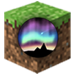

# Aurora GSI (Game State Integration) for Minecraft 1.15

Aurora GSI for Minecraft is a Fabric mod that sends game variables from Minecraft to the Aurora keyboard lighting software. Aurora can then use these variables to change the lighting on individual keys on your RGB keyboard, such as making a health bar or experience bar.

Aurora GSI is also a client-side only mod - this means you can use it even when the server doesn't!

## Installation

The precise steps for installation will depend on how you manage and launch Minecraft versions. The short version is that you simply place this mod's `.jar` file (downloaded from the [releases page](https://gitlab.com/aurora-gsi-minecraft/mc1.15-fabric/tags)) in the `mods` folder for your installation of Minecraft with Forge.

For the official client, this `mods` folder is at `%APPDATA%/.minecraft/mods`.
